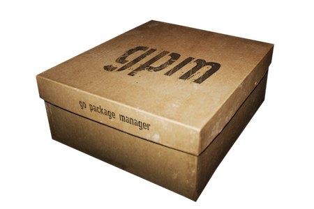
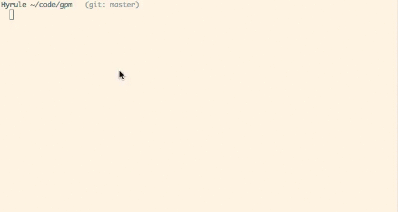

# Go Package Manager [](https://travis-ci.org/pote/gpm)

<div align="center">
  
</div>

gpm is a minimalistic package manager for Go that leverages the power of the `go get` command and the underlying version control systems used by it to set your Go dependencies to desired versions, thus allowing easily reproducible builds in your Go projects.

Go Package Manager makes no assumptions about your dependencies and supports Git, Bazaar and Mercurial hosted Go packages, for a smoother workflow be sure to check out [gvp](https://github.com/pote/gvp) - the Go Versioning Packager which  provides dependency isolation for your projects.

#### Go package versioning and vendoring with gpm + [gvp](https://github.com/pote/gvp) in one simple gif:




### Install in OSX with Homebrew

```bash
$ brew install gpm
```

### Install manually on *nix

```bash
$ git clone https://github.com/pote/gpm.git && cd gpm
$ git checkout v1.2.1 # You can ignore this part if you want to install HEAD.
$ ./configure
$ make install
```

### Use directly from GitHub (suggested for CI servers)

As gpm is a bash script you can always use it directly from GitHub via `wget` or `curl`, this is particularly useful for CI servers and other automated environments.

```bash
## With wget
$ wget -qO- https://raw.githubusercontent.com/pote/gpm/v1.2.1/bin/gpm | bash

## With cURL
$ curl -s https://raw.githubusercontent.com/pote/gpm/v1.2.1/bin/gpm | bash
```

**Note**: You can always use the version on master if you like to live dangerously by piping `https://raw.githubusercontent.com/pote/gpm/master/bin/gpm` instead of `https://raw.githubusercontent.com/pote/gpm/v1.2.1/bin/gpm`.

## The Godeps file

`gpm` expects you to have a file called `Godeps` in the root of your Go application in the format `<import path> <tag/revision>`.

Once this file is in place, running the `gpm` tool will download those packages and check out the specified versions.

```bash
$ ls .
Godeps  foo.go  foo_test.go

$ cat Godeps
github.com/nu7hatch/gotrail               v0.0.2
github.com/replicon/fast-archiver         v1.02
launchpad.net/gocheck                     r2013.03.03   # Bazaar repositories are supported
code.google.com/p/go.example/hello/...    ae081cd1d6cc  # And so are Mercurial ones

$ gpm install
>> Getting package github.com/nu7hatch/gotrail
>> Getting package github.com/replicon/fast-archiver
>> Getting package launchpad.net/gocheck
>> Getting package code.google.com/p/go.example/hello/...
>> Setting github.com/nu7hatch/gotrail to version v0.0.2
>> Setting github.com/replicon/fast-archiver to version v1.02
>> Setting code.google.com/p/go.example/hello/... to version ae081cd1d6cc
>> Setting launchpad.net/gocheck to version r2013.03.03
>> All Done
```

It is recommended to keep a healthy and exhaustive `Godeps` file in the root of all Go project that use external dependencies,
this way any project includes the documentation required to be built correctly at any point in time.


### Commands

gpm has the following commands:

```bash
$ gpm             # Same as 'install'.
$ gpm install     # Parses the Godeps file, installs dependencies and sets
                  # them to the appropriate version.
$ gpm version     # Outputs version information
$ gpm help        # Prints this message
```

### Plugins

As of version [v1.1.1](https://github.com/pote/gpm/releases/tag/v1.1.1) gpm supports plugins, the intent of which is the ability to add powerful non-core features to gpm without compromising the simplicity of its codebase.

The way gpm plugin works is simple: whenever an unknown command is passed into gpm it will look for an executable in your `$PATH` called `gpm-<command>` and if it exists it will run it while passing all extra arguments to it, simple yet powerful.

This brings a lot to the table: plugins can be written in anything, they can be Go binaries, bash scripts, Ruby gems, Python packages, you name it. gpm wants to make it easy for you to extend it. :)

#### Installing plugins through Homebrew

I maintain a [repository with homebrew formulae for gpm plugins](https://github.com/pote/homebrew-gpm_plugins) that you can add to your system with the `brew tap` command:

```bash
$ brew tap pote/gpm_plugins
```

After you've done this you can install plugins as you would with any other homebrew packge.

```bash
$ brew install gpm-bootstrap
```

If you have written a gpm plugin and want it included please send a pull request to the repo! I'd love to get a healthy plugin ecosystem going. :)

#### Official Plugins

* [gpm-bootstrap](https://github.com/pote/gpm-bootstrap) - creates a `Godeps` file for a Go project by analyzing it's dependencies and their latest releases/revisions.

### Further Reading

The creator for the [gpm-git](https://github.com/technosophos/gpm-git) and [gpm-local](https://github.com/technosophos/gpm-local) wrote a [fantastic blog post explaining the usage of rationale](http://technosophos.com/2014/05/29/why-gpm-is-the-right-go-package-manager.html) of gpm and [gvp](https://github.com/pote/gvp), it sums up explanations for several of the design decisions behind both tools. 

### Contributing

Lots of people have contributed to make gpm what it is today, if you want to take your time to play around
with the code please do so! Opening issues on bugs, feature requests or simple food for thought are a great
way to contribute, if you send a pull request please be a good citizen and do things in a tidy manner.

* Create a feature branch with a meaningful name.
* Make sure your commit messages and PR comments are informative.
* Write a test for your feature if applicable.
* Always remember to run the test suite with `make test` before comitting.

Either way, thank you **very** much for any form of contribution, even if a patch ends up not being merged
the fact that it was sent and forced us to think about it is a contribution in itself.

## License

Released under MIT License, check LICENSE file for details.

## Authorship/Inspiration/Hugs

This tool is inspired by Ruby's [dep gem](http://cyx.github.io/dep/) - authored by [@cyx](http://cyx.is/) and [@soveran](http://soveran.com/), big thanks to them and to all the contributions made by the many wonderful people in our [contributors page](https://github.com/pote/gpm/graphs/contributors).

gpm is maintained by [@pote](https://github.com/pote) and [@elcuervo](https:/github.com/elcuervo).

Go Package Manager evolved from [Johnny Deps](https://github.com/VividCortex/johnny-deps), a tool I wrote for internal use of Vivid Cortex and which is now maintained by the Vivid Cortex team.
